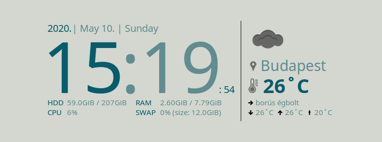
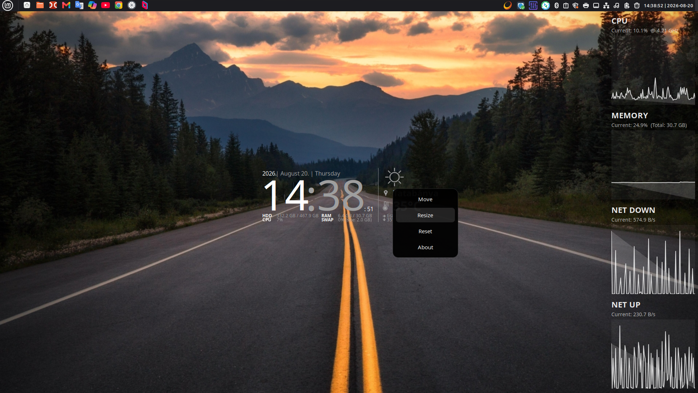
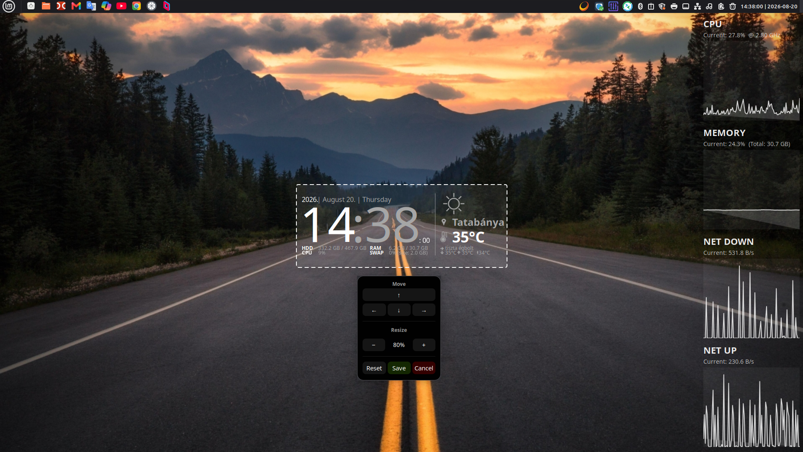
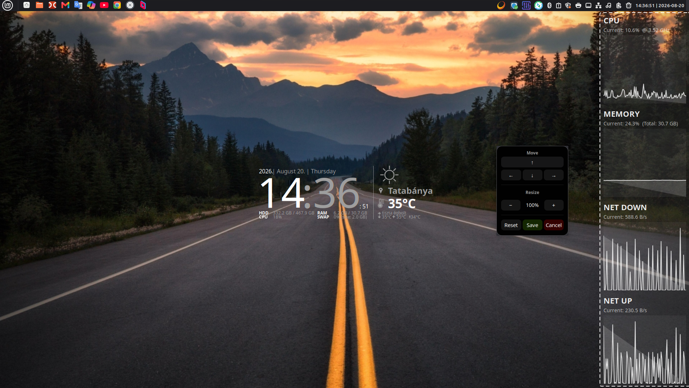

# Clock-With-Weather-EWW

[](https://github.com/takattila/Clock-With-Weather-EWW/releases)
[](WIKI.md)
[](#screenshots)
[](https://github.com/takattila/Clock-With-Weather-EWW/actions/workflows/ci.yml)

A beautiful, fully customizable **clock & weather widget** with a live
**system monitor panel** for your desktop. Runs natively on **Wayland**
(EWW + GTK layer-shell) and also works on **X11**.
Powered by the [OpenWeatherMap](https://openweathermap.org) API.

---

## Screenshots

<table>
    <tr>
        <th>Dark text with light background</th>
        <th>Light text with dark background</th>
    </tr>
    <tr>
        <td></td>
        <td></td>
    </tr>
</table>

### System Monitor Panel

<table>
    <tr>
        <th>With panel — theme: light-orange</th>
        <th>With panel — theme: dark-orange-bg</th>
    </tr>
    <tr>
        <td></td>
        <td></td>
    </tr>
</table>

### Right click on the Widgets

<table>
    <tr>
        <th>Right click</th>
        <th>Resize Weather</th>
    </tr>
    <tr>
        <td></td>
        <td></td>
    </tr>
    <tr>
        <th>Resize Panel</th>
        <th>About</th>
    </tr>
    <tr>
        <td></td>
        <td></td>
    </tr>
</table>

---

## Features

- **Clock & Weather** — time, date and live weather (temperature, icon,
  location, description, MIN/MAX/Feels) in one widget.
- **System Monitor Panel** — a side panel with real-time **CPU**, **Memory**
  and **Network Traffic** (Download/Upload) charts.
- **Dynamic Scaling** — the network charts automatically adjust their scale and
  units (KiB/s to MiB/s) based on traffic, and the active network interface is
  detected automatically.
- **Wayland native** — runs via **EWW** + GTK layer-shell; works on X11 too.
- **Light & dark ready** — supports appearance on both light and dark
  backgrounds, with a wide gallery of ready-made themes.
- **12 / 24-hour clock** — switch the hour format any time.
- **Per-widget scaling** — scale the clock and the panel independently; each
  shrinks as a single object, so the relative distances between its parts never
  change.
- **Taskbar-aware panel** — the panel aligns perfectly to your taskbar with
  per-side gaps (`panel.gap`).
- **Desktop integration** — automatic menu icons and optional desktop shortcuts.
- **Live reconfiguration** — a file watcher applies your config/theme changes
  instantly, no restart needed.

---

## How the Widget and Panel Work Together

The widget is built from **two separate but perfectly synchronized windows**:

1. **Clock & Weather** — the core component showing the time, date and weather.
2. **System Monitor Panel** — an optional side panel that snaps directly next
   to the clock and renders the live charts.

They share a **unified theme** (colors, fonts, transparency), so they always
look like a single, cohesive interface — whether you pick a light or dark theme.

---

## Quick Start

### 1. Get an OpenWeatherMap API key

Create a free account at [openweathermap.org](https://home.openweathermap.org/users/sign_up)
— the key arrives by e-mail.

### 2. Install

One-liner, root privileges are requested by the script (the installer is
**cross-distro**: it detects your package manager and installs **eww + all
dependencies**):

... via `curl`:

```bash
bash -c "$(curl -fsSLk https://raw.githubusercontent.com/takattila/Clock-With-Weather-EWW/refs/heads/master/scripts/install.sh)"
```

... or via `wget`:

```bash
bash -c "$(wget --no-check-certificate --no-cache --no-cookies -O- https://raw.githubusercontent.com/takattila/Clock-With-Weather-EWW/refs/heads/master/scripts/install.sh)"
```

> Tip: to skip the interactive API-key prompt, export your key first:
> `export OPENWEATHER_API_KEY=<YOUR-API-KEY>`

### 3. Start / stop / configure

```bash
bash ~/.eww/Clock-With-Weather-EWW/scripts/start.sh    # start the widget
bash ~/.eww/Clock-With-Weather-EWW/scripts/stop.sh     # stop the widget
bash ~/.eww/Clock-With-Weather-EWW/scripts/setup.sh    # change API key / theme / hour format
```

---

## Themes

A wide gallery of ready-made **light** and **dark** appearance themes, plus
per-city weather themes — or define your own colors inline. See the
[configuration docs](WIKI.md#configuration-configyaml) for how to switch and
customize them.

---

## Documentation

- **[WIKI — Technical documentation](WIKI.md)** — dependencies, configuration
  (`config.yaml`), project structure, EWW/CSS customization, testing and more.
- **Screenshots** — [view all](#screenshots).

---

<p align="center">
  Made with ❤️ for beautiful desktops.
</p>