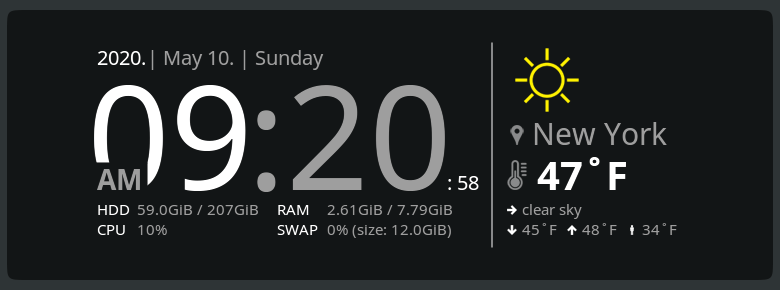
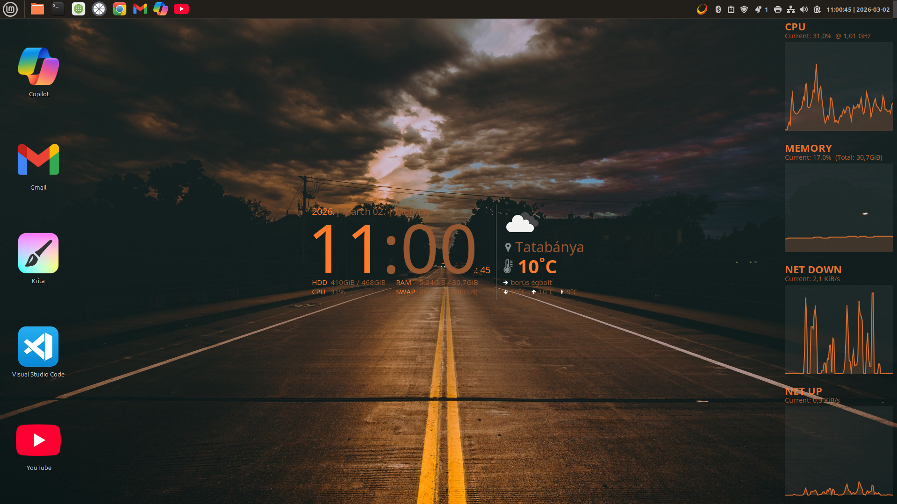
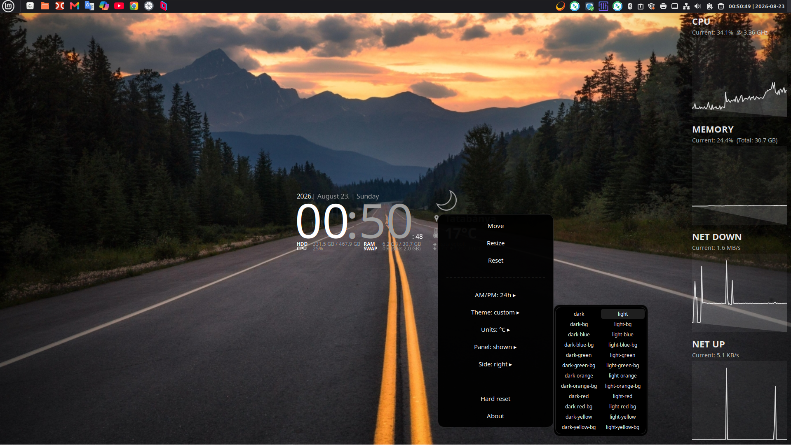
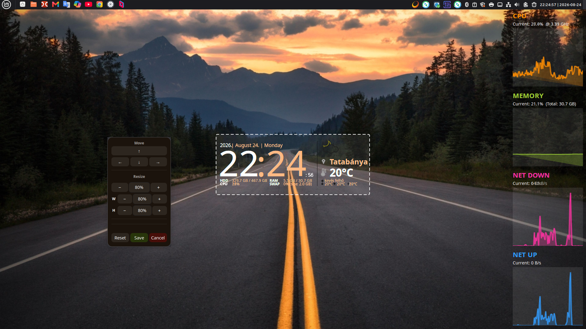
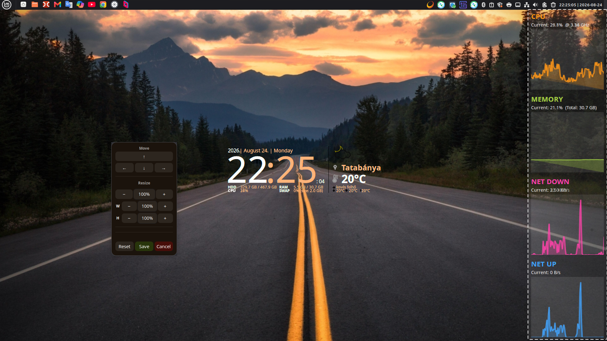
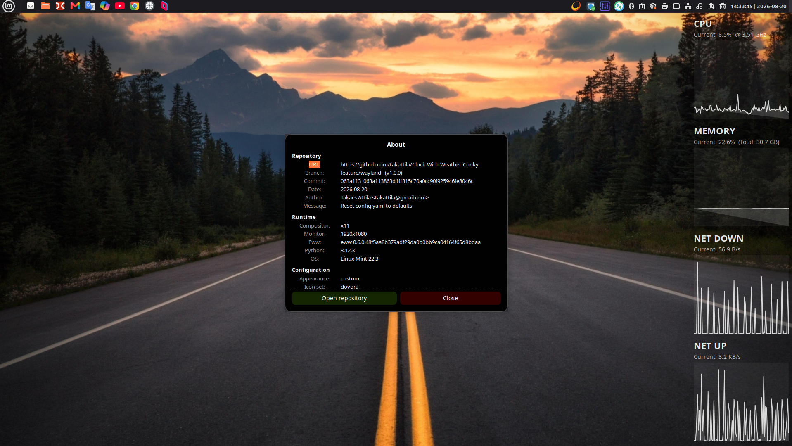

# Clock-With-Weather-EWW

[](https://github.com/takattila/Clock-With-Weather-EWW/releases)
[](https://github.com/takattila/Clock-With-Weather-EWW/actions/workflows/ci.yml)

A beautiful, fully customizable **clock & weather widget** with a live
**system monitor panel** for your desktop. Runs natively on **Wayland**
(EWW + GTK layer-shell) and also works on **X11**.
Powered by the [OpenWeatherMap](https://openweathermap.org) API.

<table>
    <tr>
        <th>Dark text with light background</th>
        <th>Light text with dark background</th>
    </tr>
    <tr>
        <td></td>
        <td></td>
    </tr>
</table>

---

## Quick Start

### 1. Get an OpenWeatherMap API key

Create a free account at [openweathermap.org](https://home.openweathermap.org/users/sign_up)
— the key arrives by e-mail.

### 2. Install

One-liner, root privileges are requested by the script (the installer is
**cross-distro**: it detects your package manager and installs **eww + all
dependencies**):

... via `curl`:

```bash
bash -c "$(curl -fsSLk https://raw.githubusercontent.com/takattila/Clock-With-Weather-EWW/refs/heads/master/scripts/bin/install.sh)"
```

... or via `wget`:

```bash
bash -c "$(wget --no-check-certificate --no-cache --no-cookies -O- https://raw.githubusercontent.com/takattila/Clock-With-Weather-EWW/refs/heads/master/scripts/bin/install.sh)"
```

> Tip: to skip the interactive API-key prompt, export your key first:
> `export OPENWEATHER_API_KEY=<YOUR-API-KEY>`

### 3. Start / stop / configure

```bash
bash ~/.eww/Clock-With-Weather-EWW/scripts/bin/start.sh      # start the widget
bash ~/.eww/Clock-With-Weather-EWW/scripts/bin/stop.sh       # stop the widget
bash ~/.eww/Clock-With-Weather-EWW/scripts/bin/setup.sh      # change API key / theme / hour format
bash ~/.eww/Clock-With-Weather-EWW/scripts/bin/hard-reset.sh # factory-reset the local config
```

---

## Screenshots

### System Monitor Panel

<table>
    <tr>
        <th>With panel — theme: light-orange</th>
        <th>With panel — theme: dark-orange-bg</th>
    </tr>
    <tr>
        <td></td>
        <td></td>
    </tr>
</table>

### Right click on the Widgets

The context menu is a quick-settings panel: Move / Resize / Reset, plus hover
submenus for the **AM/PM format** (12 ↔ 24 hour), the **theme** (all
ready-made themes, two columns, active one highlighted), **°C/°F** (with
instant weather refresh), **panel show/hide** and **panel side** — and a
factory **Hard reset** + About dialog. The menu opens instantly and always
belongs to the widget actually sitting under the pointer — even where their
transparent edges overlap. Every selection is written to the git-ignored
`config.local.yaml` and applied live.

<table>
    <tr>
        <th>Right click</th>
        <th>Resize Weather</th>
    </tr>
    <tr>
        <td></td>
        <td></td>
    </tr>
    <tr>
        <th>Resize Panel</th>
        <th>About</th>
    </tr>
    <tr>
        <td></td>
        <td></td>
    </tr>
</table>

---

## Features

- **Clock & Weather** — time, date and live weather (temperature, icon,
  location, description, MIN/MAX/Feels) in one widget.
- **System Monitor Panel** — a side panel with real-time **CPU**, **Memory**
  and **Network Traffic** (Download/Upload) charts.
- **Dynamic Scaling** — the network charts automatically adjust their scale and
  units (KiB/s to MiB/s) based on traffic, and the active network interface is
  detected automatically.
- **Wayland native** — runs via **EWW** + GTK layer-shell; works on X11 too.
- **Light & dark ready** — supports appearance on both light and dark
  backgrounds, with a wide gallery of ready-made themes (pickable from the
  right-click menu's Theme submenu).
- **12 / 24-hour clock** — switch the hour format any time (config, setup
  wizard or right-click AM/PM submenu).
- **Quick-settings context menu** — hover submenus for hour format, theme,
  °C/°F, panel show/hide and side flip, plus a factory Hard reset, one right
  click away.
- **Per-widget scaling** — scale the clock and the panel independently; each
  shrinks as a single object, so the relative distances between its parts never
  change. The Move / Resize dialog accepts a hand-typed exact percentage too —
  and dedicated **Width / Height rows**: stretch only one axis when the aspect
  ratio is not wanted (buttons, typed percentages, Shift+arrows or single-axis
  edge drags), per monitor.
- **Taskbar-aware panel** — the panel aligns perfectly to your taskbar with
  per-side gaps (`panel.gap`).
- **Desktop integration** — automatic menu icons and optional desktop shortcuts.
- **Live reconfiguration** — a file watcher applies your config/theme changes
  instantly, no restart needed.

---

## How the Widget and Panel Work Together

The widget is built from **two separate but perfectly synchronized windows**:

1. **Clock & Weather** — the core component showing the time, date and weather.
2. **System Monitor Panel** — an optional side panel that snaps directly next
   to the clock and renders the live charts.

They share a **unified theme** (colors, fonts, transparency), so they always
look like a single, cohesive interface — whether you pick a light or dark theme.

---

## Themes

A wide gallery of ready-made **light** and **dark** appearance themes, plus
per-city weather themes — or define your own colors inline. See the
[configuration docs](docs/WIKI.md#configuration-configyaml) for how to switch and
customize them.

---

## Local Overrides (`config.local.yaml`)

`config.yaml` holds the portable, committed defaults. Machine-specific values
live in the **git-ignored** `config.local.yaml`, which is deep-merged over it
(local keys win) by every reader — so local edits and everything the widget
scripts write (e.g. Move/Resize -> Save positions) never show up as git
changes:

```yaml
# config.local.yaml — only what you want to override, e.g.:
appearance: dark-orange-bg
weather:
  window:
    per_monitor:
      0: { position_x: -40, position_y: 20, scale: 0.85 }
```

`scale_x` / `scale_y` may replace `scale` when the width and the height need
different sizes (the Move/Resize dialog writes them automatically after a
width-only or height-only resize; each axis falls back to `scale`).

The setup wizard writes its choices there too; edit `config.yaml` only when a
default should change for every machine. The right-click menu toggles and the
`scripts/bin/hard-reset.sh` factory reset write / delete this file for you.

---

## Project Structure

```
Clock-With-Weather-EWW/
├── eww/                # the eww config dir: eww.yuck + eww.scss (+ generated theme files)
├── scripts/
│   ├── core/           # config / theme / watch / weather / system data scripts
│   ├── widgets/        # panel charts, context menu + quick toggles, About popups
│   ├── move/           # Move/Resize overlay + input daemons
│   └── bin/            # start.sh, stop.sh, install.sh, setup.sh, hard-reset.sh
├── assets/
│   ├── themes/         # appearance + per-city weather YAMLs
│   ├── icons-src/      # source icons (tinted copies go to generated/)
│   └── fonts/          # bundled Noto Sans
├── docs/               # WIKI, PLAN, release notes + screenshots
├── tools/              # screenshot tooling, vendored git-filter-repo
├── tests/              # headless pytest suite
├── config.yaml         # central, commented defaults
├── config.local.yaml   # git-ignored machine overrides (+ script writes)
└── logs/  run/  charts/  generated/   # git-ignored runtime outputs
```

---

## Documentation

- **[WIKI — Technical documentation](docs/WIKI.md)** — dependencies, configuration
  (`config.yaml`), project structure, EWW/CSS customization, testing and more.
- **[PLAN — feature plan](docs/PLAN.md)** — the executed plan behind the
  independent width/height resize (the previous plans for the
  `config.local.yaml` override layer and the quick-settings context menu are
  preserved in git history).
- **Screenshots** — [view all](#screenshots).

---

<p align="center">
  Made with ❤️ for beautiful desktops.
</p>